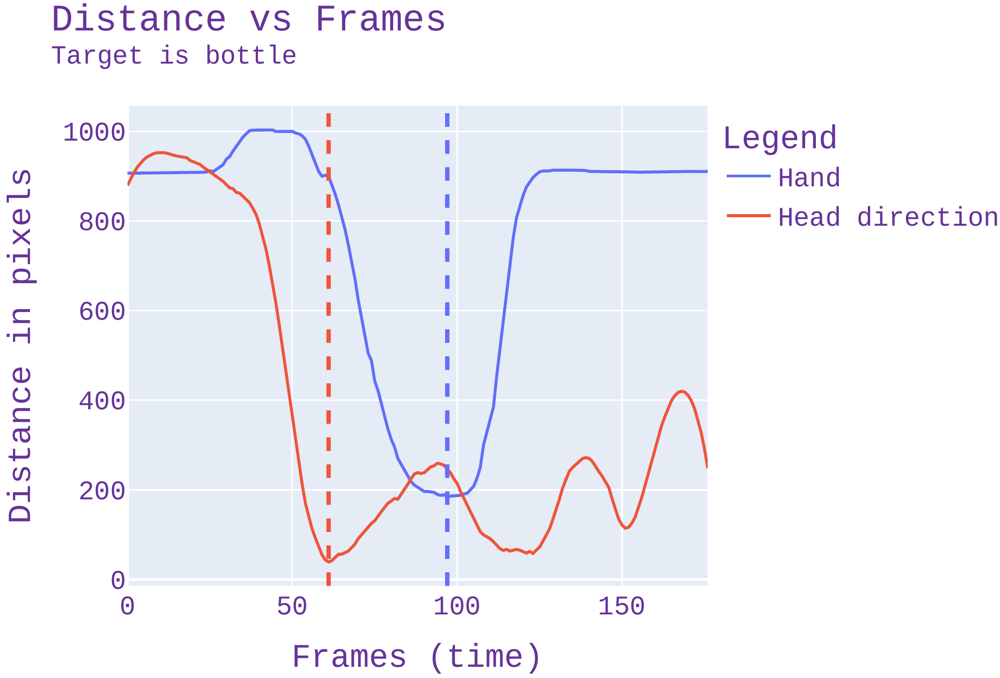
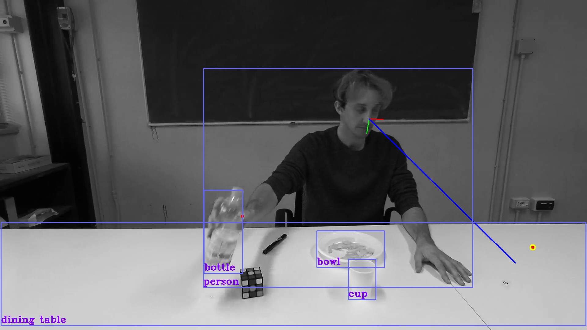

# Code for GROUND Workshop 2024 - Accepted Poster
## Anticipation through Head Pose Estimation: a preliminary study

<p style="text-align:center;"><a href="https://doi.org/10.48550/arXiv.2408.05516">Link to Paper</a></p>

Sketch of the idea: use the head direction to project the target point of view onto the table and asses its correctness as an anticipation cue.\
In the Right image it is possivle to see a graphs showing when the gaze (projected head direction) reach the target point vs the hand reaching the same point.\
in the Left image show the action being performed with all the object detected and the Head Pose drawn onto the frame.\


<p float="left">
  
  
</p>

[//]: # ()

[//]: # ()

Folder Structure
```
Workshop_GROUND/
├── example_dir/
│   ├── 00_drinking_0.txt
│   └── README.md
├── README.md
├── bboxes_load.py
├── coco_classes.py
├── env_spec.txt
├── env_spec.yaml
├── evn_cv2_spec.yaml
├── hpe_load.py
├── kpts_data_base_load.py
├── main.py
├── main_video.py
├── scratch.py
└── supervision_code.py
```

There are two main environments to be used: one using `opencv-python-headless` (exported in `env_spec.py`) and the other the regular `opencv-python` (exported in `env_cv2_spec.py`).
The one using the regular opencv allows to plot YOLO results on the fly through YOLO.

Reference for YOLOv8 and Ultralytics python methods are here:
- https://github.com/ultralytics/ultralytics
- https://docs.ultralytics.com/reference/cfg/__init__/

` main_video.py` is the starting file to use YOLO in inference to extract bounding boxes and detections of objects. Should be run in the environment using _headless opencv_.
Many other files illustrates how to use the functions. 

No Keypoints extraction is provided, however [Centernet](https://github.com/xingyizhou/CenterNet) has been used and [HHP-Net](https://github.com/Malga-Vision/HHP-Net)
is used and a running example can be found on Hugginface [demo](https://huggingface.co/spaces/FedeFT/Head_Pose_Estimation_and_LAEO_computation).

To reproduce the output graph the file `main_cv2.py` should be used. As the name suggests, the environment with _regular opencv_
should be used for plotting.

___
How to install regular opencv after installing ultralytics:
`pip install ultralytics -> version 8.2.31
pip uninstall opencv-python
pip install opencv-python`
Using opencv-python-headless
due to https://github.com/opencv/opencv-python/issues/386